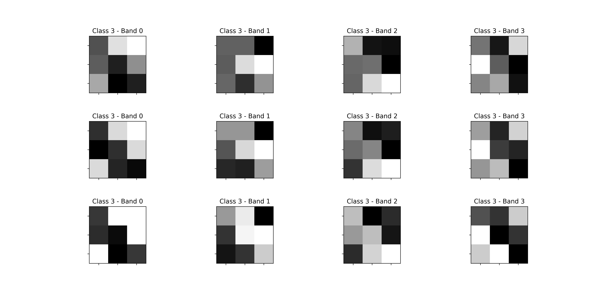

# Landsat Soil Classifier
Classifier for Landsat satellite multi-spectral images for soil type classification.

## Dataset
Multi-spectral values of pixels in 3x3 neighbourhoods in a satellite image, and the classification associated with the central pixel in each neighbourhood

More information and download links are available at:
https://archive.ics.uci.edu/ml/datasets/Statlog+(Landsat+Satellite)

Following you have an example of 3 samples (4 images (multi-spectral) of 3x3 pixeles) corresponding to class 3 (grey soil).




## Install

### Xilinx Vivado/HLS
The first requirement is that you have Xilinx Vivado and HLS installed, and your PATH updated.
To install those apps go to https://www.xilinx.com/support/download.html

### Clone the landsat_soil_classifier repo
Clone this repo wherever you want, from terminal doing:
```
git clone https://github.com/francof2a/landsat_soil_classifier.git
```

### Setting environment
I recommend use **conda environment** to execute the code. You can update your environment if it is necessary according to *./scripts/requirements.txt*.
Alternativaly you can create a new virtual environment executing:
```
./scripts/install_env.sh
```
The environment **soil_class** will be created with all necessary to run the code.

In future, you can activate this environment whenever you want doing:
```
conda activate soil_class
```

## First run
The steps you must do to create a FPGA Neural Network to classify soil types in Landsat images are:
- Create a Keras Model with your Neural Network.
- Train your model using the Landsat dataset
- Evaluate your model, and if you want you can do a checkout of it.
- Convert the Keras Model to an HLS project defining some parameters for conversion.
- Build your HLS project to make compilation, simulation, synthesis and IP implementation.
- Exporting your new IP core (IP checkout) if it is good for you.

Well, all of this seems very complicated, and the first time it was for me find the way to do all of these work out.

All this process is implemented in **run_all.py** script, so let's go to check if libraries are installed correctly runing this script without modifications:
```
python run_all.py
```
This script is going to create a Neural Network with 2 hidden-layers of 50 neurons each, with ReLu activations and Softmax output layer and execute all the process described before.
Good luck!

> Check the *./outputs/* folder to find results like figures, reports, models.<br>
> Check the *./models/* folder to find the checkouts of Keras models.<br>
> Check the *./ip/* folder to find the checkouts of Xilinx IP cores generated.<br>


## Custom Run
In order to execute your custom Run, first you should understand how to build a new model and set the parameters of the script.

### Predefined models
**soil_classifier** lib provides you a set of predefined very simple NN models to use. These models are in *soil_clssifier.models.minimals* python module. Feel free to use all of them or create a new one. These models embeded the architecture, optimizer, loss function and metrics to use into the its class.

In the script you can specify the model to use in:
```python
# Model
MODEL_NAME = 'ANN50x50'
```

Next, configure the preprocessing of data for training and for FPGA testing
```python
# Dataset
X_DATA_PROC = 'standarization' # options: standarization/normalization/original
Y_DATA_PROC = 'one-hot'
FPGA_DATA_FORMAT = '%.6f'
```

Configure parameters for Model training
```python
# Training
N_epochs = 200
batch_size = 32
do_model_checkout = True
```
Last step of configuration is defined KERAS to HLS conversion parameters.
```python
# Config (conversion Keras to HLS)
PART = 'xazu7eg-fbvb900-1-i'
T_CLK = 24 # ns
IO_TYPE = 'io_parallel' # options: io_serial/io_parallel
PRECISION = [24, 8]
REUSE_FACTOR = 4
STRATEGY = 'Latency' # options: Latency/Resource
```
- PART: Xilinx FPGA/SoC part number
- T_CLK: Clock period in nanoseconds
- IO_TYPE: is the way the input data (samples) are going to be passed to IP core
- PRECISION: is the numeric precision to implement the model into FPGA. Fisrt field is the total number of bit of values, and second field is the number of bits for decimals.
- REUSE_FACTOR: is the maximum number of clock cycles to execute one step calculation into de Model implementation. If you increase this number, the latency increase but the FPGA resources needed are less.
- STRATEGY: You choose if you want to priorize *Latency* o *Resource*.

## HLS4ML
This is the library used to convert KERAS models into FPGA IP cores. The *hls4ml* folder into this repository is modified version of original library.
The **hls4ml repository** is: 

https://github.com/hls-fpga-machine-learning/hls4ml

you can find more information in:

https://fastmachinelearning.org/hls4ml/

J. Duarte et al., "Fast inference of deep neural networks in FPGAs for particle physics", JINST 13 P07027 (2018), arXiv:1804.06913.
